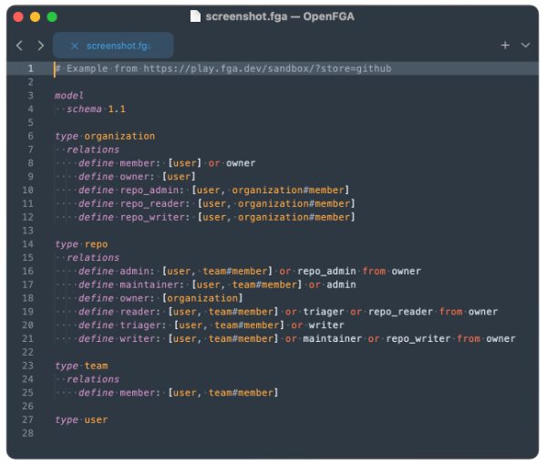

# OpenFGA

OpenFGA syntax for Sublime Text.



## Customization

If you want it to look more like OpenFGA docs, an easy Mariana customization:
```
		{
			"scope": "source.openfga keyword.declaration, source.openfga keyword.operator",
			"foreground": "color(var(white3) a(0.7))"
		}
```


